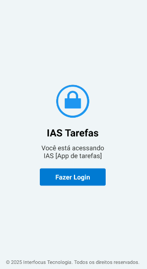
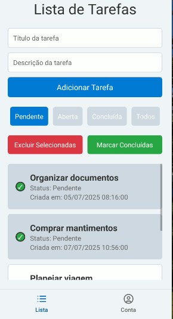
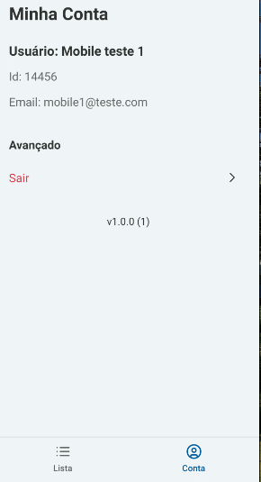

<h1 align="center">App IAS Telecom</h1>

<p align="center">
  

  

  

  <a href="https://github.com/williamjayjay/Github-Blog/commits/master">
    
  </a>

   <a href="https://github.com/williamjayjay/mobile-ias-telecom/stargazers">
    
  </a>
</p>

<p align="center"><p align="center">
Este aplicativo tem como principais funcionalidades fazer login com acesso na plataforma Interfocus, cadastrar, concluir e remover tarefas.</p>

## 🥶 Sobre o projeto

Desenvolvi esse projeto para uma das etapas do teste para a Interfocus.

## Mobile React Native:

**Aplicativo:** O app irá fazer login com usuarios credenciados no sistema Interfocus e conseguir gerenciar tarefas dentro do mesmo.

## 🚀 Tecnologias

Principais tecnologias que utilizei para desenvolver esta aplicação
Aqui está a lista das bibliotecas no formato desejado, com os nomes das bibliotecas e links para suas documentações ou páginas oficiais, seguindo o padrão `- [Library](link)`:

- [@react-native-async-storage/async-storage](https://docs.expo.dev/versions/latest/sdk/async-storage/): 2.1.2
- [@react-navigation/native](https://reactnavigation.org/docs/getting-started/): ^7.1.14
- [@react-navigation/native-stack](https://reactnavigation.org/docs/native-stack-navigator/): ^7.3.21
- [@react-navigation/bottom-tabs](https://reactnavigation.org/docs/bottom-tabs-navigator/): 7.2.0
- [@react-navigation/stack](https://reactnavigation.org/docs/stack-navigator/): ^7.4.2
- [@testing-library/jest-native](https://testing-library.com/docs/ecosystem-jest-native/): ^5.4.3
- [@testing-library/react-hooks](https://react-hooks-testing-library.com/): ^8.0.1
- [@testing-library/react-native](https://callstack.github.io/react-native-testing-library/): ^13.2.0
- [expo](https://docs.expo.dev/): ~53.0.13
- [expo-auth-session](https://docs.expo.dev/versions/latest/sdk/auth-session/): ~6.2.0
- [expo-crypto](https://docs.expo.dev/versions/latest/sdk/crypto/): ~14.1.5
- [expo-secure-store](https://docs.expo.dev/versions/latest/sdk/securestore/): ~14.2.3
- [expo-splash-screen](https://docs.expo.dev/versions/latest/sdk/splash-screen/): ~0.30.9
- [expo-status-bar](https://docs.expo.dev/versions/latest/sdk/status-bar/): ~2.2.3
- [jest](https://jestjs.io/): ~29.7.0
- [jest-expo](https://docs.expo.dev/guides/testing-with-jest/): ~53.0.7
- [react](https://react.dev/): 19.0.0
- [react-native](https://reactnative.dev/): 0.79.4
- [react-native-flash-message](https://www.npmjs.com/package/react-native-flash-message): ^0.4.2
- [react-native-safe-area-context](https://docs.expo.dev/versions/latest/sdk/safe-area-context/): 5.4.0
- [react-native-screens](https://docs.expo.dev/versions/latest/sdk/screens/): ~4.11.1
- [zod](https://zod.dev/): ^3.22.4
- [react-native-svg](https://docs.expo.dev/versions/latest/sdk/svg/): 15.8.0
- [lucide-react-native](https://lucide.dev/docs/react-native): 0.456.0

## Detalhe CI CD

No arquivo ci_cd.yml observe o alias para a criar a secret no github que irá conter o token expo para assim podermos criar um fluxo de automação CI CD que irá executar o build da aplicação, rodar os testes unitários e por fim gerar o apk do aplicativo android no caso.

## Testes unitários

Para rodar os testes basta iniciar o comando:

```sh
bun run test
```

## Guia de inicialização

Para instalar e configurar uma cópia local, siga estas etapas simples:

### Prerequisitos

Para garantir o funcionamento adequado da nossa aplicação, verifique abaixo:

1. **Clone o repositório**:

```sh
git clone https://github.com/williamjayjay/mobile-ias-telecom
```

2. **Navegue na raiz do projeto mobile-ias-telecom:**

3. **Instale os módulos:**

```sh
bun i
```

4. **Copie o .env de exemplo:**

5. **Rode o aplicativo e escaneie o qrcode ou use com celular plugado via usb:**

```sh
bun tt
```

## Roadmap

- [x] Iniciar o aplicativo, entrar na tela de login

- [x] Na tela de login conseguir navegar para a webview de autenticação da Interfocus

- [x] Logar com o usuario e armazenar os dados do mesmo

- [ ] Caso seja o primeiro login, settar 50 tarefas iniciais para esse usuário

- [x] Conseguir concluir e excluir as tarefas

- [x] Conseguir concluri e excluir em massa ao pressionar por um longo tempo

- [x] Conseguir visualizar mais informações

- [x] Conseguir criar uma nova tarefa

- [x] Conseguir ver dados do usuario e deslogar do app

<!-- --------------------- -->

## UI UX

|                  Tela de login                  |                 Tela Home                  |
| :---------------------------------------------: | :----------------------------------------: |
|  |  |

|                  Tela de perfil                   |
| :-----------------------------------------------: |
|  |
