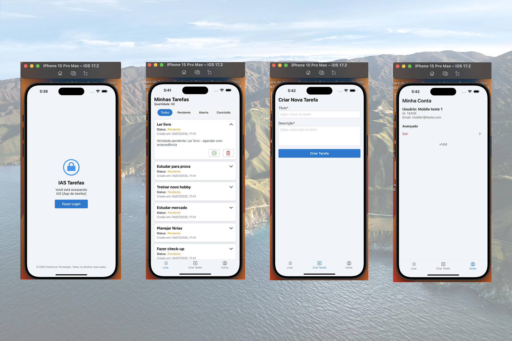

<h1 align="center">App IAS Telecom (React Native - Expo)</h1>

<p align="center">
  

  

  
  
  <a href="https://github.com/williamjayjay/Github-Blog/commits/master">
    
  </a>
    
   <a href="https://github.com/williamjayjay/mobile-ias-telecom-step2/stargazers">
    
  </a>
</p>

<p align="center">
This application is a challenge for mobile developers, focused on creating a simple yet functional app that follows the coding and organizational standards used in the company. The goal is to develop a to-do list application that performs login via OAuth2 using the Interfocus system, while keeping data stored locally on the device, ensuring a user-friendly interface and a smooth user experience.
</p>

<p align="center">

</p>

## 🎥 VideoCase

<p align="center">
  <video src="https://github.com/user-attachments/assets/3fb0f5c2-563a-4733-a0f1-cb563c364ea5" controls loop muted autoplay style="max-width: 100%; height: auto; display: block; margin: 0 auto;">
    Your browser does not support the video tag.
  </video>
</p>


## 🥶 About the Project

I developed this project as part of a mobile developer challenge to improve my skills in React Native, navigation, and state management. The main goal was to create a functional and user-friendly to-do list app that follows best practices and industry standards.

## 📲 Mobile React Native:

**Application:** The app allows users to log in via OAuth2 using the Interfocus system through Expo Auth Session, manage their to-do tasks, and persist data locally using AsyncStorage. It features a responsive design and smooth user experience, leveraging tools like React Navigation with Tab Navigator, React Hook Form for form handling, and FlashMessage for user feedback. The codebase follows clean architecture principles and includes unit tests with Jest to ensure reliability and maintainability.

## 🚀 Technologies  

Key technologies used in this application:  

- [Expo](https://expo.dev/)  
- [Typescript](https://www.typescriptlang.org)
- [React Native](https://reactnative.dev/)  
- [React](https://react.dev/)  
- [React Navigation Native](https://reactnavigation.org/)  
- [React Navigation Native Stack](https://reactnavigation.org/docs/stack-navigator/)  
- [React Navigation Bottom Tabs](https://reactnavigation.org/docs/bottom-tab-navigator)  
- [React Native Safe Area Context](https://github.com/th3rdwave/react-native-safe-area-context)  
- [React Native Screens](https://github.com/software-mansion/react-native-screens)  
- [React Native Gesture Handler](https://docs.swmansion.com/react-native-gesture-handler/)  
- [React Native Async Storage](https://github.com/react-native-async-storage/async-storage)  
- [Hookform Resolvers](https://react-hook-form.com/get-started/#SchemaValidation)  
- [Zod](https://zod.dev/)  
- [React Hook Form](https://react-hook-form.com/)  
- [Lucide React Native](https://lucide.dev/docs/lucide-react-native)  
- [React Native Flash Message](https://github.com/lucasferreira/react-native-flash-message)  
- [React Native SVG](https://github.com/software-mansion/react-native-svg)  
- [Jest](https://jestjs.io/)  
- [Jest Expo](https://github.com/expo/jest-expo)  
- [Expo Auth Session](https://docs.expo.dev/versions/latest/sdk/auth-session/)  


## CI/CD Details

In the `ci_cd.yml` file, note the alias used to create the secret on GitHub that will contain the Expo token. This enables the creation of a CI/CD automation flow that will build the application, run unit tests, and finally generate the APK for the Android app.

## Unit Tests

To run the tests, simply execute the following command:

```sh
bun run test
```


## Getting Started

To install and configure a local copy, follow these steps:

### Prerequisites

Ensure the following steps are completed to run the app:

**1. Clone the repository**:
```sh
git clone https://github.com/williamjayjay/mobile-ias-telecom-step2
```

**2. Navigate to the root of the project mobile-ias-telecom**

**3. Copy the example .env file::** 

**4. Install the dependencies**:
  ```sh
  bun i
  ```

**5. Run the application**:
  ```sh
  bun start
  ```
   or with script 
  ```sh
  bun tu
  ```


## Roadmap

- [x] Launch the app on the main screen with a button to log in

- [x] When clicking to log in, open the browser to authenticate the user via OAuth

- [x] Log the user in and, if it’s their first login, add 50 random tasks for them

- [x] If it’s the first login, set 50 initial tasks for that user

- [x] Be able to complete and delete individual tasks

- [x] Be able to complete and delete tasks in bulk by long-pressing

- [x] Be able to view more information about tasks

- [x] When opening and closing a task, move it to the “open” status

- [x] Be able to create a new task

- [x] Display toast notifications on success or error

- [x] On the profile screen, be able to view user data and log out of the app

<!-- --------------------- -->